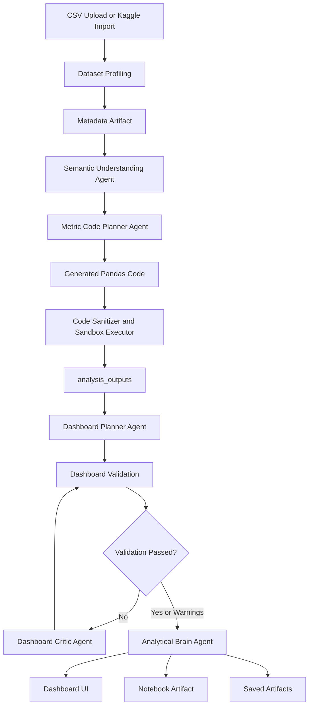
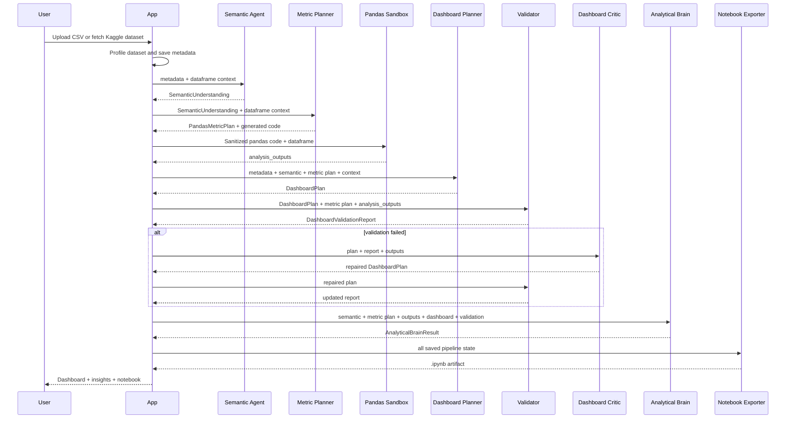
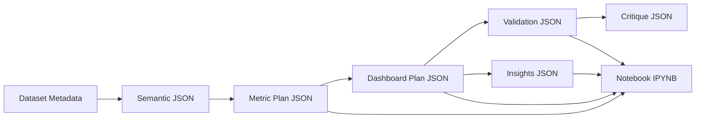
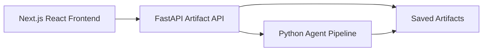

# Dashboard Studio: Detailed Project Introduction

This page explains the purpose, architecture, agent workflow, and product direction of Dashboard Studio.

It is more detailed than the README. Use this document when you want to understand how the system works internally and why it is designed this way.

---

## 1. Objective

Dashboard Studio is an AI-assisted analytics system that turns a structured dataset into an explainable dashboard.

The objective is not just to generate charts. The objective is to create a traceable analytical workflow:

1. Understand the dataset.
2. Decide what questions are worth asking.
3. Generate deterministic analysis code.
4. Execute the code locally.
5. Validate the outputs.
6. Plan a dashboard.
7. Repair weak dashboard plans.
8. Produce narrative insights.
9. Save an audit trail.
10. Let a user inspect how the dashboard was made.

The long-term goal is to feel like a careful AI analyst working with the user, not a black-box chart generator.

---

## 2. Core Product Promise

Given a CSV dataset, Dashboard Studio should answer:

- What is in this data?
- What does each important column mean?
- What metrics and dimensions matter?
- What questions can this dataset answer?
- What code was run to compute the answers?
- Which charts are appropriate?
- Which charts are risky or misleading?
- What are the main insights?
- What assumptions and limitations should the user know?
- Can the whole process be reviewed later?

---

## 3. Current Application State

The current implementation has:

- Streamlit app for the working UI
- FastAPI read-only artifact API for the planned frontend migration
- OpenAI-powered structured-output agents
- pandas metric execution
- dashboard validation rules
- dashboard critic repair loop
- analytical insight generation
- notebook audit trail generation
- artifact history and restore
- tests for agent contracts, chart validation, notebook export, and API contracts

The product UI is currently being overhauled on the `ui-overhaul` branch.

---

## 4. Architecture Overview

Dashboard Studio separates reasoning from execution.

LLMs are used for:

- semantic interpretation
- metric/code planning
- dashboard planning
- dashboard critique
- insight synthesis

Deterministic Python is used for:

- dataset profiling
- code validation
- sandboxed pandas execution
- chart rendering
- dashboard validation
- notebook generation
- artifact storage

This separation is critical. It lets the system use LLMs where they are useful, while keeping calculations inspectable and reproducible.



---

## 5. System Layers

| Layer | Responsibility | Current Implementation |
| --- | --- | --- |
| Data ingestion | Upload CSV or fetch Kaggle CSV | `app.py` |
| Profiling | Infer schema, dtypes, stats, nulls | `app.py` |
| Semantic reasoning | Understand domain and columns | `agents/semantic_understanding.py` |
| Metric planning | Generate analysis plan and pandas code | `agents/metric_code_planner.py` |
| Execution | Run generated code safely | `app.py` sandbox helpers |
| Dashboard planning | Select KPIs/charts/question views | `agents/dashboard_planner.py` |
| Validation | Detect invalid/misleading dashboard specs | `dashboard_validation.py` |
| Critique | Repair dashboard plans | `agents/dashboard_critic.py` |
| Insights | Produce analytical narrative | `agents/analytical_brain.py` |
| Notebook | Generate audit trail `.ipynb` | `notebook_export.py` |
| Current UI | Interactive prototype UI | `app.py` Streamlit |
| Future UI API | Read-only artifact contract | `api.py` |

---

## 6. Agent Communication Diagram

The agents do not talk to each other freely. They pass structured outputs through the app pipeline.



---

## 7. Artifact Flow

Artifacts are the memory of the system.

They allow:

- history restore
- debugging failed runs
- notebook generation
- frontend API responses
- future comparison between runs



Artifact folders:

| Folder | Contents |
| --- | --- |
| `artifacts/metadata` | dataset metadata, latest pointer, metadata index |
| `artifacts/datasets` | saved CSV copies |
| `artifacts/semantic` | semantic understanding outputs |
| `artifacts/metric_plans` | generated metric plans and failed attempts |
| `artifacts/dashboard` | dashboard plans and validation reports |
| `artifacts/critiques` | dashboard critic repair outputs |
| `artifacts/insights` | analytical brain outputs |
| `artifacts/notebooks` | generated Jupyter notebooks |
| `artifacts/logs` | app logs |

---

## 8. Why Validation Exists

Generated dashboards can be technically valid but analytically misleading.

Validation catches issues such as:

- chart references missing output key
- chart references missing column
- line chart has too few x values
- line chart has too many series
- chart ignores extra categorical dimensions
- average/rating ranking lacks sample size
- top averages include tiny sample groups
- chart values are tightly clustered and need scale disclosure
- declared axis scale clips actual data
- wide-form metric chart does not match renderer contract

Validation is not just error checking. It is product quality control.

---

## 9. Why The Notebook Exists

The dashboard is the polished consumption view.

The notebook is the audit trail.

The notebook should answer:

- What data was loaded?
- What did the semantic agent infer?
- What code did the metric planner generate?
- What outputs did that code produce?
- What dashboard did the planner create?
- What did validation reject or warn about?
- What did the critic repair?
- What insights did the analytical brain produce?

Important safety rule:

> The app does not execute arbitrary notebook code in the browser.

The app executes metric code through the existing sandbox first. The notebook then records the code and captured outputs.

---

## 10. Current UI Problem

The current Streamlit UI works, but it feels generic because:

- layout is constrained by Streamlit
- charts look like default Plotly outputs
- tabs expose backend stages too literally
- artifact/debug language appears in the main path
- dashboard sections feel like stacked cards
- there is limited control over frontend state and navigation

This is why the project is moving toward a dedicated frontend.

---

## 11. UI Overhaul Direction

The planned frontend architecture:



Recommended frontend stack:

- Next.js
- React
- TypeScript
- Tailwind CSS
- Radix UI or shadcn/ui
- TanStack Query
- Zustand or Jotai
- ECharts, Vega-Lite, or Plotly.js

The Streamlit app should remain available as an internal development/debug shell until the new frontend covers the core workflows.

---

## 12. UI Overhaul Priority Ladder

### Critical

- Build stable FastAPI artifact contracts.
- Keep Streamlit working.
- Do not change agent execution behavior yet.
- Let a future frontend read runs, dashboard plans, validation, insights, and notebooks.

### High

- Build the Next.js product shell.
- Render existing artifacts in a polished UI.
- Implement dashboard and notebook read-only views.
- Add frontend chart guards.

### Medium

- Add generation actions and job polling.
- Add history comparison.
- Improve chart interactivity and table fallback.
- Add user-friendly validation surfacing.

### Low

- Visual polish, transitions, command palette, keyboard shortcuts, and full Streamlit retirement.

---

## 13. Documentation Priority Ladder

### Critical

- Beginner-friendly README.
- Detailed project introduction page.
- Clear setup instructions.
- Clear agent architecture and artifact explanation.

### High

- API documentation with request/response examples.
- Agent input/output schema reference.
- Dashboard validation rule reference.
- Notebook artifact guide.

### Medium

- Contributor guide.
- Troubleshooting guide with common errors.
- Example walkthroughs using real Kaggle datasets.
- Architecture decision records.

### Low

- Screenshots, diagrams exported as images, demo GIFs, branding copy, and polished docs site.

---

## 14. How To Run The Main Surfaces

Streamlit app:

```powershell
streamlit run app.py
```

FastAPI artifact API:

```powershell
uvicorn api:app --reload --port 8000
```

Tests:

```powershell
python -m unittest discover -s tests
```

---

## 15. Key Design Principles

### Be transparent

Every major output should be traceable back to code, data, and agent decisions.

### Prefer deterministic computation

LLMs should not invent numbers. Python should compute numbers.

### Validate before rendering

The dashboard should protect users from misleading charts.

### Make history useful

Saved artifacts should prevent repeated agent work when data and context have not changed.

### Keep the UI calm

The product should feel like a serious analytical workspace, not a flashy demo.

---

## 16. Future Possibilities

- conversational dashboard editing
- live database connectors
- scheduled dashboard refresh
- agent memory across datasets
- dashboard comparison across runs
- collaborative review
- natural-language chart repair
- export to PDF or slides
- richer notebook execution/replay
- dataset quality scoring
- controlled multi-agent notebooks

---

## 17. Success Criteria

The project is succeeding if:

1. A beginner can load a dataset and generate a dashboard.
2. The dashboard is understandable.
3. The charts are validated.
4. The calculations are inspectable.
5. The notebook explains what happened.
6. The system avoids unsupported claims.
7. The user can trust the audit trail.
8. Developers can extend the app without breaking the pipeline.

